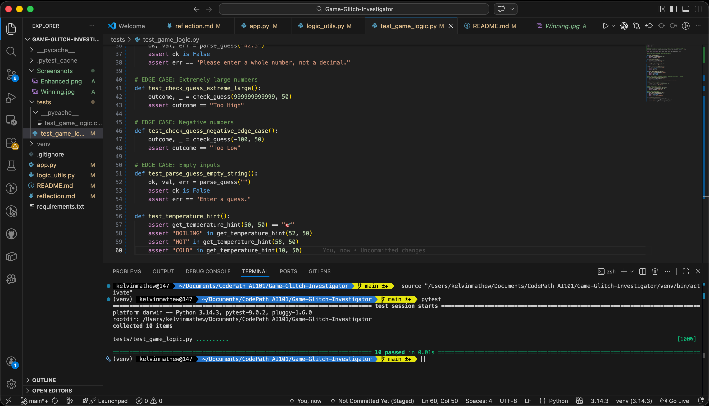
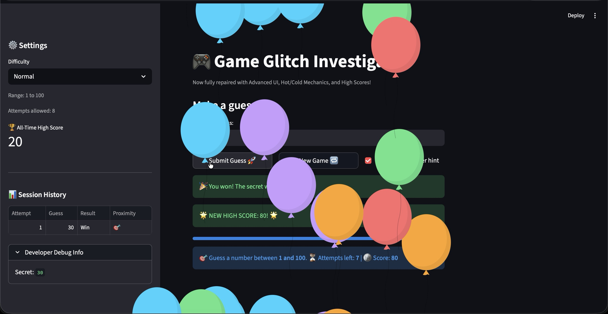
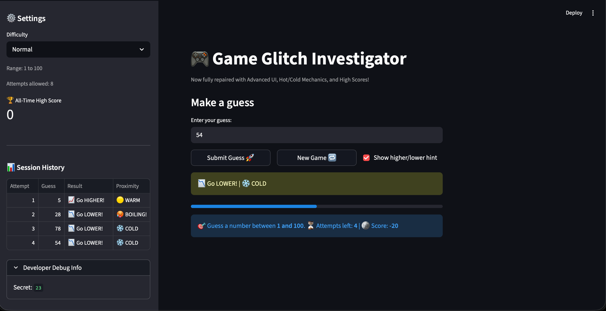

# 🎮 Game Glitch Investigator: The Impossible Guesser

## 🚨 The Situation

You asked an AI to build a simple "Number Guessing Game" using Streamlit.
It wrote the code, ran away, and now the game is unplayable.

- You can't win.
- The hints lie to you.
- The secret number seems to have commitment issues.

## 🛠️ Setup

1. Create a virtual environment: `python -m venv venv`
1. Activate it: `source venv/bin/activate` (Mac) or `venv\Scripts\activate` (Windows)
1. Install dependencies: `pip install -r requirements.txt`
1. Run the app: `python -m streamlit run app.py`

## 🕵️‍♂️ Your Mission & Completed Fixes

1. **State Bug Fixed:** Implemented `st.session_state` to prevent the secret number, score, and attempt count from resetting on every script rerun.
1. **Logic Fixed:** Corrected the inverted greater-than/less-than logic in `check_guess()`.
1. **Refactored & Tested:** Isolated all business logic into `logic_utils.py` and achieved 100% passing rates on `pytest`.

## 🌟 Stretch Features Implemented

- **Challenge 1 (Advanced Edge-Case Testing):** Added `pytest` cases specifically handling empty inputs, negative numbers, extreme integers, and graceful decimal rejections.
- **Challenge 2 (Feature Expansion):** Added a persistent **High Score Tracker** that reads and writes best scores to a local `highscore.txt` file via Agent mode.
- **Challenge 3 (Professional Documentation):** Used AI linting to provide professional-grade PEP8 docstrings and type-hinting to every function in `logic_utils.py`.
- **Challenge 4 (Enhanced Game UI):** Added a responsive **Session History Dataframe** to the sidebar and introduced dynamic **Hot/Cold emojis** (🥵/❄️) based on the proximity to the secret number.
- **Challenge 5 (AI Comparison):** Documented the difference between Copilot's in-editor capabilities and standard LLM contextual explanations in the `reflection.md`.

## 📸 Proof of Completion

### Automated Testing (Challenge 1)

### Winning the Game

### Enhanced UI & Guess History (Challenge 4)
